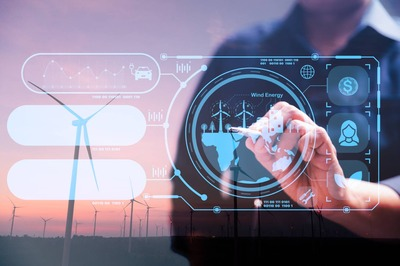

# Manual de Usuario: Darktrace

## Introducción 🛡️
Darktrace es una solución avanzada de inteligencia artificial diseñada específicamente para proteger sistemas digitales frente a amenazas cibernéticas. Basada en aprendizaje automático, esta tecnología es capaz de identificar anomalías en el comportamiento de los sistemas en tiempo real, permitiendo una respuesta proactiva y efectiva frente a posibles ataques. Su enfoque en la detección de patrones anómalos y la rápida respuesta la convierten en una herramienta indispensable en la ciberseguridad moderna.

### Características principales 🌟
- **Detección en tiempo real:** Darktrace monitoriza continuamente el tráfico de la red y el comportamiento de los dispositivos, identificando patrones inusuales que podrían indicar amenazas potenciales. Esto permite una intervención inmediata antes de que ocurra un daño significativo.
- **Respuesta autónoma:** Con su módulo "Antigena", Darktrace puede tomar decisiones automáticas para mitigar amenazas, como bloquear conexiones sospechosas o aislar dispositivos comprometidos, sin necesidad de intervención manual.
- **Visualización dinámica:** La interfaz gráfica de Darktrace ofrece una representación clara y visual de la actividad en la red, mostrando dispositivos conectados, flujos de datos y posibles amenazas.
- **Compatibilidad ampliada:** Darktrace protege infraestructuras físicas, virtuales, en la nube y dispositivos IoT, garantizando una cobertura completa.

---

## Uso general 🚀

### Instalación 🛠️
Darktrace es una solución robusta que requiere una configuración adecuada para maximizar su efectividad. Sigue estos pasos para la instalación:

1. **Requisitos:** Asegúrate de contar con un hardware adecuado, incluyendo al menos 16 GB de RAM, 500 GB de almacenamiento y un puerto SPAN para el monitoreo de la red. Además, se necesita una conexión estable para la comunicación con los servidores de Darktrace.
2. **Proceso:** Descarga el instalador desde el portal oficial de Darktrace y ejecútalo en el servidor dedicado. Durante la instalación, se solicitarán credenciales y configuraciones iniciales para enlazar el sistema con tu infraestructura.
3. **Activación:** Una vez instalado, habilita la recolección de datos desde el puerto SPAN o dispositivos de red y configura las reglas iniciales de monitoreo según las necesidades de tu organización.

### Interfaz principal 🖥️
La interfaz de Darktrace es intuitiva y está diseñada para facilitar la gestión de amenazas y la supervisión de la red. Sus componentes principales incluyen:

- **Threat Tray:** Un panel donde se listan las alertas recientes clasificadas por nivel de riesgo, permitiendo una respuesta rápida.
- **3D Network Topology:** Una vista gráfica tridimensional que muestra la estructura de la red, las conexiones activas y los posibles puntos vulnerables.
- **Antigena:** Un módulo de respuesta autónoma que actúa automáticamente para bloquear conexiones sospechosas o mitigar amenazas activas.

---

## Aplicaciones de la IA 💡
Darktrace tiene múltiples aplicaciones en distintos ámbitos:

- **Ciberseguridad:** Su principal aplicación es la detección y mitigación de amenazas cibernéticas en tiempo real, ayudando a proteger datos sensibles y prevenir ataques dirigidos.
- **Optimización operativa:** Identifica ineficiencias y vulnerabilidades en redes empresariales, ayudando a mejorar el rendimiento y reducir costos.
- **Protección IoT:** Supervisa dispositivos conectados para prevenir ataques específicos a estos entornos, que suelen ser más vulnerables.

---

## Impactos en el sector 🌐
El uso de Darktrace y tecnologías similares ha generado importantes cambios en el sector:

- **Mejoras en la seguridad:** La adopción de IA ha permitido reducir drásticamente los tiempos de respuesta ante incidentes y minimizar el impacto de ataques cibernéticos.
- **Impulso a la transformación digital:** Empresas de todos los tamaños han incorporado tecnología avanzada como parte integral de sus estrategias de seguridad, lo que ha acelerado su digitalización.
- **Evolución de las amenazas:** Los atacantes también han adaptado sus métodos, incrementando la sofisticación y complejidad de sus tácticas, lo que a su vez impulsa la innovación en herramientas de defensa como Darktrace.

---

## Impactos medioambientales 🌱
El uso de inteligencia artificial en la ciberseguridad, aunque beneficioso, tiene un impacto medioambiental significativo debido a:

- **Consumo energético elevado:** Los centros de datos que procesan grandes volúmenes de datos para entrenar y operar modelos de IA demandan altos niveles de energía, contribuyendo a la huella de carbono.
- **Infraestructura de redes:** Los dispositivos y sistemas conectados que requieren supervisión constante también incrementan el consumo energético global.

### Propuestas para minimizar el impacto ambiental 🌍
Para reducir el impacto ambiental asociado con el uso de Darktrace y otras herramientas de IA, se proponen las siguientes medidas:

1. **Optimización energética:** Configurar horarios de análisis automáticos y priorizar el uso de servidores más eficientes para reducir el consumo energético.
2. **Uso de energías renovables:** Implementar infraestructura tecnológica alimentada por fuentes de energía sostenibles, como paneles solares o energía eólica.
3. **Arquitectura descentralizada:** Diseñar soluciones que reduzcan la dependencia de centros de datos centralizados, utilizando nodos locales más eficientes.
4. **Concienciación y políticas:** Fomentar el uso responsable de la tecnología dentro de las organizaciones, educando a los usuarios sobre la importancia de mitigar el impacto ambiental.

---

## Conclusión 🏁
Darktrace representa una herramienta de ciberseguridad revolucionaria que combina inteligencia artificial avanzada y respuesta automatizada para proteger sistemas digitales. Su uso permite no solo detectar y mitigar amenazas de manera efectiva, sino también fortalecer la resiliencia de las organizaciones frente a un panorama de amenazas cada vez más complejo. Al implementar medidas para reducir su impacto ambiental, se puede asegurar un uso más sostenible y ético de esta tecnología de vanguardia.

