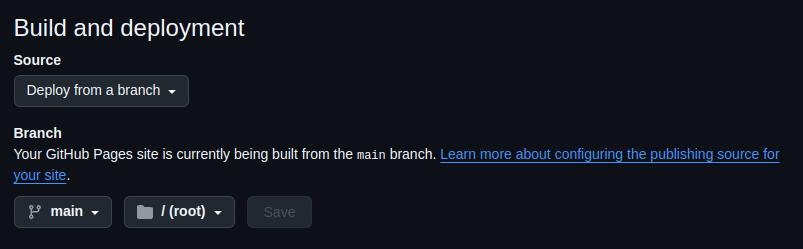
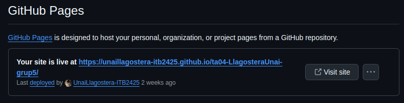
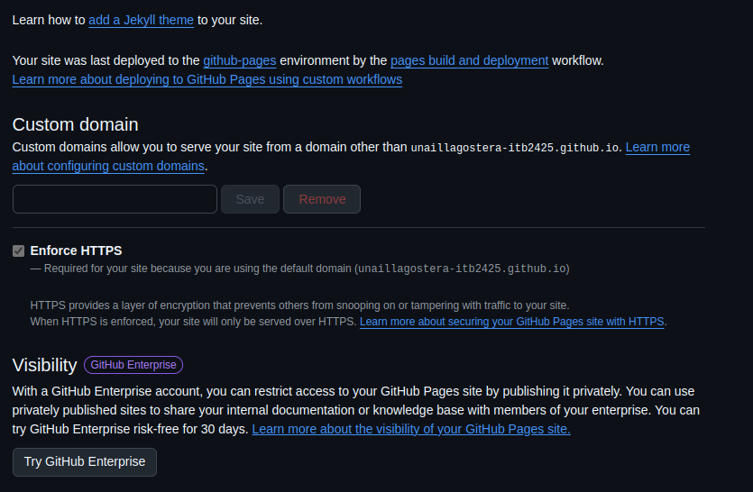

## Uso y características

GitHub Pages es una herramienta gratuita que permite a los usuarios publicar sitios web estáticos directamente desde sus repositorios en GitHub. Está pensada para simplificar la creación de contenido web básico, como páginas HTML, CSS, JavaScript y archivos relacionados, como es el caso de Markdown. Su principal ventaja radica en su facilidad de uso, ya que solo es necesario crear un repositorio y seleccionar una rama para que el sitio web se despliegue de forma automática. Además, GitHub Pages se integra perfectamente con el flujo de trabajo de Git, lo que permite que cualquier cambio realizado en el repositorio se refleje sin complicaciones en el sitio web. Aunque GitHub Pages ofrece un subdominio gratuito (por ejemplo, `usuario.github.io`), también es posible usar un dominio personalizado. En resumen, GitHub Pages es una herramienta accesible y poderosa para quienes desean crear y publicar sitios web estáticos de manera sencilla y gratuita.

> **⚠️ Nota importante:** El uso de GitHub Pages está **estrictamente prohibido** con fines comerciales.

## 📝 Requisitos

Para poder publicar en GitHub Pages, es necesario tener una cuenta en GitHub y crear un repositorio que contenga el código correspondiente, que debe seguir una estructura compatible con GitHub, como HTML, CSS, entre otros. Además, el repositorio debe incluir, como mínimo, un archivo en la raíz /ROOT que sirva como índice.

## 👣 Pasos para publicar

**1.** Accede a la configuración de tu repositorio.

**2.** Luego, dirígete a la sección de Pages.

**3.** Verás el siguiente menú:

Debes seleccionar "deploy from a branch" y, por defecto, mantenerlo en la rama principal (main) dentro de la carpeta raíz (root). Se recomienda organizar los archivos dentro de una carpeta llamada "src" y colocar el archivo de índice o README fuera de esta para presentar el sitio.

## ✅ Confirmación

Para verificar que tu página se ha publicado correctamente, solo debes esperar unos minutos. En la sección donde configuraste la publicación de tu repositorio, aparecerá un mensaje emergente con un enlace que te redirigirá a tu página web.

Una vez que hagas clic en el enlace, serás dirigido a tu nueva página, que mostrará la información contenida en los archivos del repositorio, siempre que todos los datos sean correctos.

## Funciones adicionales

Aquí te mostramos algunas características extra de GitHub Pages:

🔹 **Dominio personalizado:** GitHub no solo te proporciona un subdominio, sino que también te permite añadir un dominio personalizado para tu sitio web.

🔹 **Forzar HTTPS:** Esta opción asegura que tu sitio web siempre se sirva utilizando el protocolo HTTPS, que cifra la información entre el navegador del usuario y el servidor. GitHub recomienda activar esta opción para garantizar que tu sitio sea accesible solo a través de HTTPS, lo cual mejora la privacidad y la seguridad de los usuarios.

🔹 **Visibilidad:** Esta opción está disponible para los usuarios de GitHub Enterprise, la versión de GitHub diseñada para organizaciones y equipos privados. Al publicar un sitio en GitHub Pages en un entorno de GitHub Enterprise, puedes decidir mantener el acceso restringido y hacerlo privado, lo que resulta útil para compartir documentación interna, recursos exclusivos o bases de conocimiento dentro de tu organización, sin que sean visibles para el público general.

---

[**Volver al Índice**](../../README.md)
